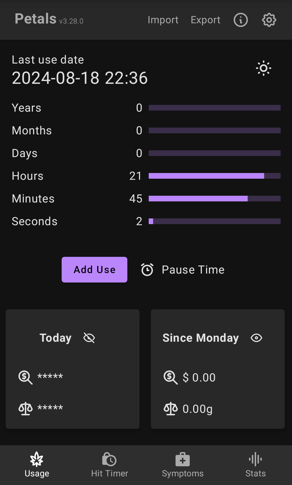
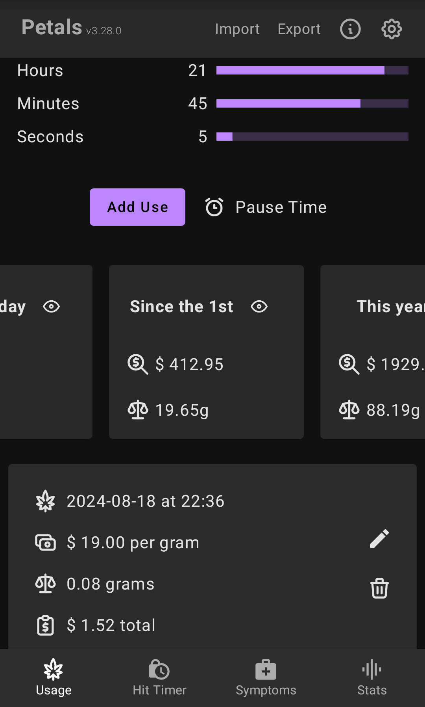
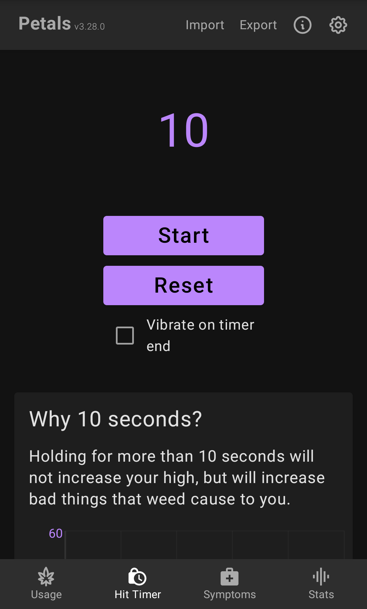

# Petals

[](https://github.com/LeoColman/Petals/blob/main/LICENSE)
[](https://github.com/LeoColman/Petals/actions/workflows/unit-tests.yaml)
[](https://github.com/LeoColman/Petals/actions/workflows/lint.yaml)
[](https://github.com/LeoColman/Petals/actions/workflows/dependency-analysis.yaml)
<a href="https://hosted.weblate.org/engage/petals-app/">

</a>

<a href="https://www.producthunt.com/posts/petals?utm_source=badge-featured&utm_medium=badge&utm_souce=badge-petals" target="_blank"></a>

[](https://ko-fi.com/K3K62Y2GB)

------

The Open Source app Petals aims to help its users to either quit weed, reduce usage or simply know how much they're
using.

Download from the [Releases Page](https://github.com/LeoColman/Petals/releases) or from any of the options below

[](https://f-droid.org/packages/br.com.colman.petals/)
[](https://play.google.com/store/apps/details?id=br.com.colman.petals)

## Translations
Translations are hosted at Weblate. You can contribute to your language [here](https://hosted.weblate.org/engage/petals-app)

<a href="https://hosted.weblate.org/engage/petals-app/">

</a>

<br>

<a href="https://hosted.weblate.org/engage/petals-app/">

</a>

## Screenshots

<details>
<summary>Open to see screenshots</summary>





[More Screenshots](fastlane/metadata/android/en-US/images/phoneScreenshots)

</details>

## Building

### Signed

The signed version (the one published to Github and PlayStore) can be built with:

```
./gradlew packageGithubReleaseUniversalApk
```

You must first decrypt secrets using `git secret reveal`

### Unsigned

If you're building an unsigned version, build the same one that goes to FDroid (as FDroid signs the app themselves).

```
./gradlew packageFdroidReleaseUniversalApk
```

This approach doesn't require secrets.

## Git Secrets

The **Keystore**, **Keystore Properties** and **Google Play deploy json** files are included in the repository using
[git secret](https://git-secret.io/). The current secret owners are:

- Leonardo Colman Lopes
    - Fingerprint `B3A5 9909 9ECC 4DB4 FD40 896F 7706 1922 C587 2792`
    - Original Author

- Github Actions
    - Fingerprint `1FF0 67E9 C75F A1BC 51D2 FC75 BA87 7D2B 9560 920A`
    - Auto-publishing signed app to github
    - Expires on 2024-07-29
    - Available on environment secret `GPG_KEY`

## Releasing

Release to all our channels are made automatically after a tag is released. The workflow responsible for doing that
is [release.main.kts](.github/workflows/release.main.kts).

### Google Play Store

1. Decrypt all git secrets
2. Run `./gradlew packageGithubReleaseUniversalApk`
3. Publish to playstore
   running `bundle config path vendor/bundle && bundle install --jobs 4 --retry 3 && bundle exec fastlane playstore`

### F-Droid

F-Droid builds automatically from the repository whenever a new tag is published. The definitions for how to build the
app are
in [FDroid's data repository](https://gitlab.com/fdroid/fdroiddata/-/blob/master/metadata/br.com.colman.petals.yml). If
modifications are required, the place to change is there.

### Releases Page
1. Decrypt all git secrets
2. Run `./gradlew packageGithubReleaseUniversalApk`
